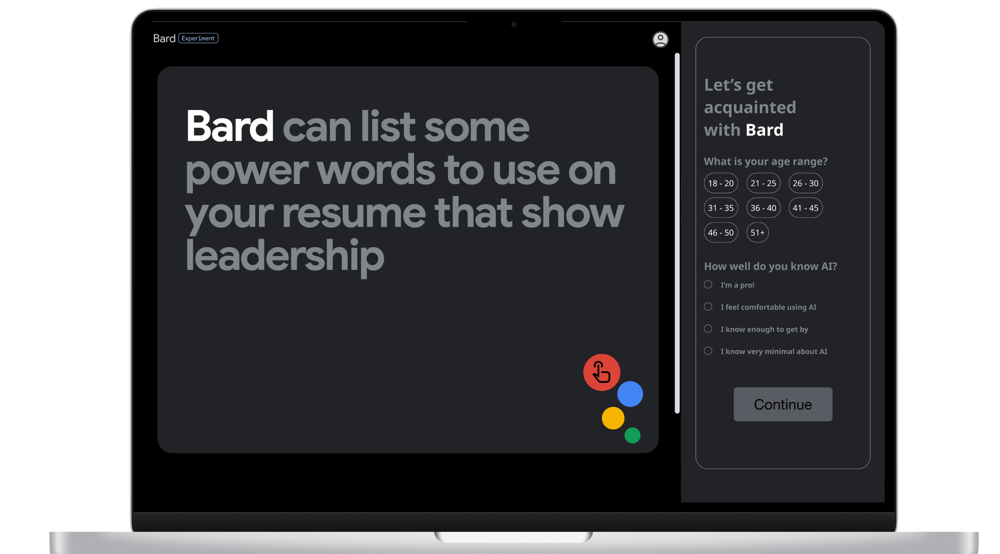

# SideBard - Empowering Google Suite Users with AI Education

Welcome to the GitHub repository of **Team AInsight** for the Google Industry Day competition hosted by BrainStation. We are a dynamic team comprising data scientists, UX/UI designers, and web developers, driven by our passion for innovation and our commitment to delivering impactful solutions to real-world challenges.

## 🚀 Our Team
- Abi Wheeler (UX/UI Designer)
- Diane Lu (Data Scientist)
- Jack Speidel (Software Engineer)
- Maheshi Nawarathna (Software Engineer)
- Nima Chinikar (Data Scientist)
- Sam Celarek (Data Scientist)
- Tony Lau (Software Engineer)
- Gem Ruby (Team Lead and Technical Advisor)

## 🤔 The Challenge
Google posed an intriguing question for the competition:

"How might we educate users about new AI-related features becoming a part of our product while maintaining their trust and avoiding misunderstandings about AI?"

## 💡 Our Solution - SideBard
Introducing **SideBard**, an intelligent sidebar for all Google Suite Products, enhanced with AI capabilities. This revolutionary sidebar incorporates an advanced chatbot, leveraging Google's extensive help resources and usage guidelines to provide users with informative answers and empower them to make the most of AI features. SideBard not only serves as a practical tool but also symbolizes Google's dedication to educating users and ensuring a seamless AI experience.

## Demonstration of Product

### See SideBard
Take a glimpse of our visually appealing sidebar through the Figma Prototype [here](https://www.figma.com/proto/htu5k0wM0Xg3FJK4vGhh2C/Google---Industry-Project---Workspace?page-id=6%3A3&type=design&node-id=18-212&viewport=-1347%2C379%2C0.56&t=ZOkx9GZUwVS9qznG-1&scaling=min-zoom&starting-point-node-id=18%3A212&mode=design).

### Chat with SideBard
Experience the power of our customized chatbot by interacting with the Jupyter notebook [here](https://github.com/ebeui/Google_Industry_Project/blob/906403df0a490482cc0cb3e324f359718c39abe5/SideBard%20Chatbot/Play_with_Sidebard.ipynb). The notebook requires two dependencies: `function_source.py` and `google_docs.csv`.

**Question:** How do I sum all the costs of this store in Google Sheets?

**Answer:** Hello Samir! To sum all the costs of a store in Google Sheets, use the SUM function. Follow these steps:

- Select the cell where you want the sum to appear.
- Type "=SUM(" in the cell.
- Select the range of cells containing the costs you want to sum.
- Close the parentheses ")" and press Enter.

For example, if the costs are in cells A1 to A10, you would enter "=SUM(A1:A10)" in the cell. This will calculate the sum of all the costs in the specified range and display the result in the selected cell.

### SideBard's Presentation
Explore our comprehensive [presentation](https://github.com/ebeui/Google_Industry_Project/blob/906403df0a490482cc0cb3e324f359718c39abe5/Google%20-%20Industry%20Project%20-%20Team%207.pdf) to delve deeper into our work. Additionally, find our market research, web app development, Figma designs, and KPI dashboard using PowerBI in the reference section below.

## References
- [Market Research](https://github.com/ebeui/Google_Industry_Project/blob/906403df0a490482cc0cb3e324f359718c39abe5/Market%20Research%20and%20KPIs/General%20Questions%20about%20AI%20and%20Uses.pdf)
- [Chatbot Creation](https://github.com/ebeui/Google_Industry_Project/blob/906403df0a490482cc0cb3e324f359718c39abe5/SideBard%20Chatbot/Question_Embedding_and_Search.ipynb)
- [Web App Development](https://github.com/ebeui/Google_Industry_Project/tree/906403df0a490482cc0cb3e324f359718c39abe5/Web%20Dev%20Folder)
- [Figma Designs](https://www.figma.com/proto/htu5k0wM0Xg3FJK4vGhh2C/Google---Industry-Project---Workspace?page-id=6%3A3&type=design&node-id=18-212&viewport=-1347%2C379%2C0.56&t=ZOkx9GZUwVS9qznG-1&scaling=min-zoom&starting-point-node-id=18%3A212&mode=design)
- [KPI Dashboard using PowerBI](https://github.com/ebeui/Google_Industry_Project/blob/906403df0a490482cc0cb3e324f359718c39abe5/Market%20Research%20and%20KPIs/google.pbix)

Thank you for your interest in our exciting project, SideBard! We warmly invite you to explore our work and provide valuable feedback.

## Contact Us
If you have any questions, suggestions, or feedback, please feel free to reach out to us through GitHub or email us at [dianengalu@gmail.com](mailto:dianengalu@gmail.com). We value your input and look forward to hearing from you!

Thank you for your interest in SideBard! Together, let's revolutionize AI education and enhance user experiences. 🌟
